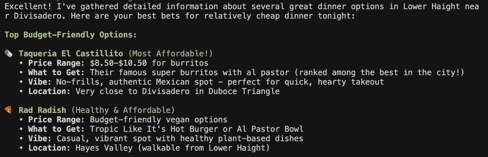

# Find _your_ food

Find Food is a conversational app that finds specific, orderable menu items
that match a user's dietary restrictions near a location. It returns menu-item
recommendations with restaurant context, source-backed dietary fit, caveats,
and accommodations.



## Current Architecture

```txt
Browser / Vercel frontend
  -> Next.js + Assistant UI (`app/`)
  -> AI SDK chat route on the Mastra server
     POST /chat/findFood
       -> Find Food orchestrator agent (`orchestra/`)
          -> Exa MCP web search
          -> researchRestaurant tool
             -> bounded restaurant research agent
          -> Mastra working memory + Mem0
          -> libsql / Turso storage and Mastra observability
```

Active runtime:

- `app/` - Next.js frontend using Assistant UI.
- `orchestra/` - Mastra TypeScript backend, agents, tools, memory, storage, and deployment config.
- `legacy/` - old Codebuff implementation kept only for prompt/architecture reference.

The old Go backend and Codebuff runtime are no longer the active app.

## Project Layout

```txt
app/
  src/app/                     Next.js app shell
  src/components/assistant.tsx Assistant UI chat frontend

orchestra/
  src/cli.ts                   local interactive CLI
  src/server.ts                optional custom HTTP/SSE server at /api/chat
  src/mastra/index.ts          Mastra instance, agents, storage, /chat/:agentId
  src/mastra/agents/           orchestrator and research agents
  src/mastra/tools/            researchRestaurant tool
  src/mastra/memory/           Mastra memory + Mem0 tools
  .mastra-project.json         linked Mastra project (`food-agent`)

legacy/
  .agents/                     original Codebuff agent definitions
  architecture.md              legacy behavior notes

plan.md                       migration plan / design notes
TODOs                         older project TODOs
```

## Local Development

Backend setup:

```bash
cd orchestra
nvm use
npm install
```

Backend environment is read from `orchestra/.env` or the repo-root `.env`.
Required for real agent runs:

```bash
EXA_API_KEY=...
OPENROUTER_API_KEY=...
MEM0_API_KEY=...
```

Optional production/shared storage:

```bash
MASTRA_DB_URL=libsql://<db-name>-<org>.<region>.turso.io
MASTRA_DB_AUTH_TOKEN=...
```

Run the Mastra dev server:

```bash
cd orchestra
npm run dev
```

This starts the local backend at:

```txt
http://localhost:4111
POST http://localhost:4111/chat/findFood
```

Frontend setup:

```bash
cd app
npm install
npm run dev
```

Open:

```txt
http://localhost:3000
```

The frontend defaults to `http://localhost:4111/chat/findFood`. Override the
backend base URL with `NEXT_PUBLIC_MASTRA_URL` if needed.

### CLI

The CLI runs the same Mastra agent in-process; it does not call an HTTP server.

```bash
cd orchestra
npm run cli
```

### Optional Custom HTTP Server

`orchestra/src/server.ts` provides a separate hand-rolled SSE API:

```bash
cd orchestra
npm run serve
```

```txt
GET  http://127.0.0.1:3000/health
POST http://127.0.0.1:3000/api/chat
```

The Next frontend does not use this server.

## Production Architecture

Production is split across two hosts:

- **Vercel frontend** - `https://find-food-kohl.vercel.app/`
- **Mastra Server backend** - `https://food-agent.server.mastra.cloud/`

The deployed frontend calls:

```txt
https://food-agent.server.mastra.cloud/chat/findFood
```

The Mastra Studio/dashboard is separate:

```txt
https://food-agent.studio.mastra.cloud
```

## Deploy

### Backend: Mastra Server

Run from `orchestra/`:

```bash
mastra server deploy
```

This updates the API used by the Vercel frontend, including:

```txt
POST /chat/findFood
GET  /api/agents
POST /api/agents/:agentId/generate
```

If backend environment variables changed, update them on Mastra Server:

```bash
mastra server env import .env
```

Deploy Studio only when the dashboard/playground bundle needs to be updated:

```bash
mastra studio deploy --project food-agent
```

### Frontend: Vercel

Import the GitHub repo into Vercel and set:

```txt
Root Directory: app
Framework: Next.js
Build Command: npm run build
```

Set this Vercel environment variable:

```bash
NEXT_PUBLIC_MASTRA_URL=https://food-agent.server.mastra.cloud
```

Do not put backend secrets such as `OPENROUTER_API_KEY`, `EXA_API_KEY`, or
`MEM0_API_KEY` in the Vercel frontend project. Those belong on the Mastra
Server deployment.

## Verify

Frontend:

```bash
cd app
npm run lint
npm run build
```

Backend:

```bash
cd orchestra
npm run typecheck
```

Production backend:

```bash
curl https://food-agent.server.mastra.cloud/api/agents
curl -i -X POST https://food-agent.server.mastra.cloud/chat/findFood
```

For the chat route, a non-404 response means the `chatRoute` is deployed. A
400-style response can be expected if the probe has no request body.

## More Detail

- Backend details, memory, Turso, observability, and deployment notes:
  `orchestra/README.md`
- Frontend package:
  `app/`
- Legacy Codebuff reference:
  `legacy/`
